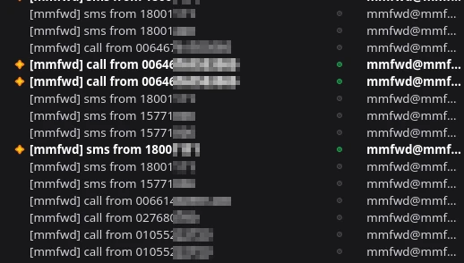
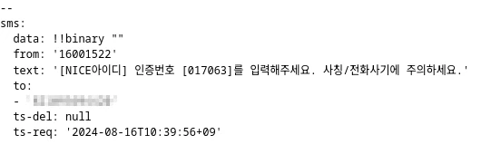
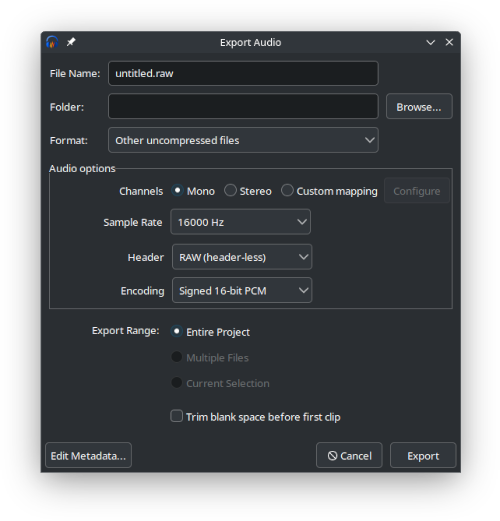

# MMFWD
Forward calls and texts using ModemManager framework.

This is a daemon that forwards calls and text messages via email and
SIP(planned?). I made this python program to receive KYC messages whilst I'm
overseas. South Korea is a weird county where all KYC verifications are done via
personal mobile number. Without a mobile number, doing anything online is almost
impossible. The daemon can be run on a small and reliable device that is kept
somewhere safe.

- https://pygobject.gnome.org/getting_started.html
- https://code.nap.av.it.pt/mobility-networks/modemmanager/-/tree/1.18.12/examples/modem-watcher-python





## Call answering machine (mmfwd-callam)
https://github.com/user-attachments/assets/b4782fbf-cf7d-4dba-8e81-26a8a6e084a0

<video controls src="doc/img/sim7600-rickroll.post1.720p.mp4" title="sim7600-rickroll.post1.720p.mp4"></video>

Usage:

```sh
mmfwd-callam <modem audio char path> <output prefix>
```

Making audio samples:

```sh
ffmpeg -i FILE -vn -ar 16000 -ac 1 -f s16le OUTFILE.pcm
```

or use Audacity:
- Go to `File` - `Export Audio`
  - Format: "Other uncompressed files"
  - Channel: Mono
  - Sample Rate: 16000 Hz
  - Header: RAW (header-less)
  - Encoding: Signed 16-bit PCM
Audacity overrides the extension to .raw. Change it to .pcm.



The audio streaming is handled by the child process `mmfwd-callam` since the
audio serial port is synchronous(CTS/RTS). Common tools like `aplay` and
`arecord` do not support nonblocking IO.

[src/mmfwd-callam.cpp](src/mmfwd-callam.cpp):

```c
void init_params (void) {
	params.hello_sample_pat = "hello/*.pcm";
```

Place PCM files in `hello/*.pcm`. Then the main mmfwd Python module can spawn
the process.

[src/mmfwd/__init__.py](src/mmfwd/__init__.py):
```py
now = datetime.datetime.now(datetime.UTC)

n_from = call.get_number() or ""

dir = "rec/%02d-%02d" % (now.year, now.month)
filename = now.isoformat(timespec = 'milliseconds') + '_' + n_from
path = dir + '/' + filename

os.makedirs(dir, exist_ok = True)

exec = [ ud.instance.callam['exec'], "/dev/" + ud.audio_port, path ]
ud.instance.callam_proc = subprocess.Popen(exec)
# 5 minutes timeout
ud.instance.callam_timer = GLib.timeout_add_seconds(
	60 * 4,
	self.on_call_timeout,
	ud)
```

A pair of recorded audio files will be placed in
`rec/YYYY-MM/<ISOTIME in millis resolutiono>_<NUMBER>.<INOUT>` where

- NUMBER is the phone number of the calling party
- INOUT is "in" for the audio from the calling party and "out" for from mmfwd

To encode the recorded raw audio files:

```sh
ffmpeg -ar 16000 -ac 1 -f s16le -i PCM_FILE -c:a libopus OUTFILE.ogg
```

## MM Patches
- https://gitlab.freedesktop.org/mobile-broadband/ModemManager/-/merge_requests/1293
- https://gitlab.freedesktop.org/mobile-broadband/ModemManager/-/issues/996

## Another idea (070 number)
Major telcos in South Korea(KT, SKT, LG U+) offer VoIP services. After
subscribing to such services, the SIP credentials can be extracted from the
device. AFAIK, the telcos' SIP servers don't do whitelist connections so the
credentials can be used pretty much from anywhere with any SIP+VoIP client
implementations.

Sources:

- https://blog.naver.com/rehearsal/80099885977
- https://www.clien.net/service/board/use/1219343
- https://koreapyj.dcmys.kr/152

ModemManager and LTE modems such as SIM7600 are usually optimised for mobile
date network connectivity on Linux world, not for voice calls. You might as well
get a 070 number(the standard VoIP prefix in Korea) and redirect the calls and
messages to the SIM number to the VoIP number to get high quality audio straight
from the telcos' IP core network.

- Pro: Stable audio stream
- Con: Adding another point of failure to the system
